

Rainfactory's Speedy and Traffic Resilient Static Site Setup
=================
### :heart: Middleman :heart: CircleCi :heart: AWS :heart: Prismic

Welcome to our Middleman-AWS-Prismic-CircleCi open source project!
We've used this setup to create high-traffic crowdfunding sites for [Rainfactory](http://www.rainfactory.com/) clients
(e.g.
[LunaSleep](http://lunasleep.com/),
[Swypcard](https://www.swypcard.com/),
[Fove](http://www.getfove.com/)
)
at [Monsoon](http://www.monsoonco.com/).
The following provides step-by-step instructions for generating a static site with Middleman, Amazon Web Services, CircleCI and Prismic.

## Ingredients
* [Middleman](https://middlemanapp.com/)
* Middleman gems [Middleman S3 Sync](https://github.com/fredjean/middleman-s3_sync) and [Middleman Cloudfront](https://github.com/andrusha/middleman-cloudfront)
* [AWS S3](http://aws.amazon.com/s3/) and [AWS Cloudfront](http://aws.amazon.com/cloudfront/)
* [CircleCI](https://circleci.com/) as a continuous integration platform for deployment to AWS and for automated testing
* [Prismic](https://prismic.io/) for Content Management

## Table of Contents
1. [Running the local web server](#web_server)
2. [Create a new Middleman Site](#new_middleman_project)
3. [Set permissions and download AWS access keys in AWS Identity & Access Management (IAM)](#aws_iam)
4. [Setup an AWS S3 Bucket](#aws_s3)
5. [Create an AWS Cloudfront Distribution](#aws_cloudfront)
6. [Add Middleman s3 sync gem and configuration](#aws_middleman_s3_gem)
7. [Add Middleman cloudfront gem and configuration](#aws_middleman_cloudfront_gem)
8. [Pushing assets to AWS from your console as a first test](#aws_local_test)
9. [CircleCI for continuous deployment](#circleci)
10. [Set Environmental Variables in CircleCi](#circleci_vars)
11. [Prismic Content Management](#prismic)
12. [Launch in AWS](#launch)

 1. Running the local web server
-------------

If you're pulling down this repo and want to get it running, do the following:

1. **Bundle Gems**

   <code> bundle install </code>

2. **Compile files**

   <code> bundle exec middleman build </code>

3. **Start a local web server running at: http://localhost:4567/**

   <code> bundle exec middleman </code>

 2. Create a new Middleman site
-------------

1. Follow steps to [install Middleman](https://middlemanapp.com/basics/install/) and [start a new site](https://middlemanapp.com/basics/start_new_site/)

 3. Set permissions and download AWS access keys in AWS Identity & Access Management (IAM)
-------------

1. After an AWS account has been setup, go to AWS IAM to set permission and download AWS keys (AWS access key id and AWS secret key).
You can set specific permissions to Users or Groups as needed (read more about it [here](http://docs.aws.amazon.com/IAM/latest/UserGuide/policies_overview.html)).
Here's a basic example of adding AdministratorAccess to a User (see below).
You'll need to save your AWS Keys for setting environmental variables in [CircleCi](#circleci_vars) (AWS_ACCESS_KEY_ID, AWS_SECRET_KEY).

  **Create a New User**
  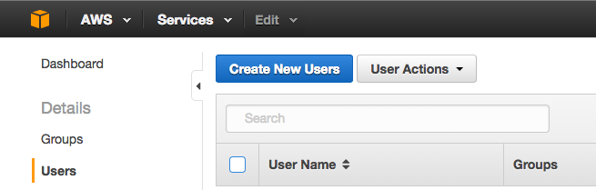

  **Enter a user name**
  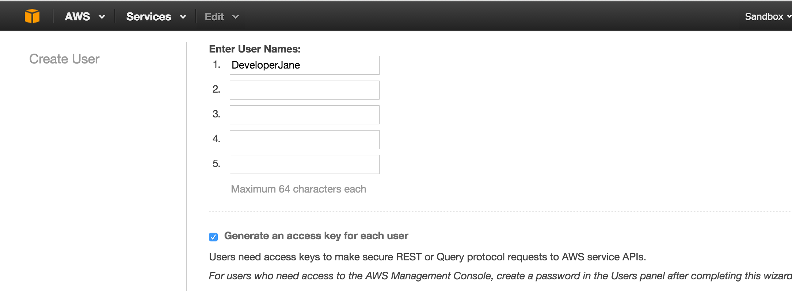

  **Download User Security Credentials**
  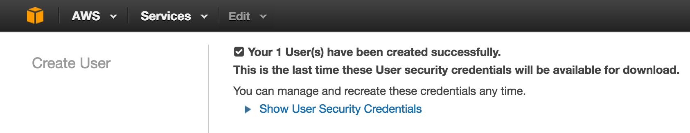

  **Attach Policy to the new User**
  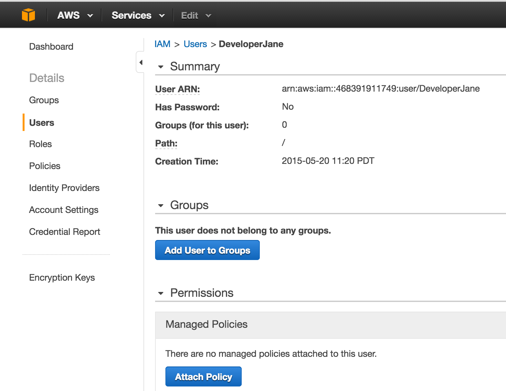

  **Check off AdminstratorAccess**
  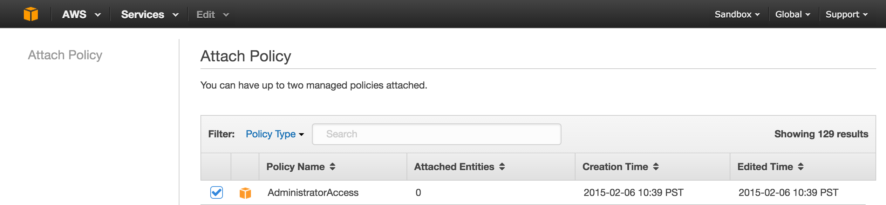

 4. Setup an AWS S3 Bucket
-------------
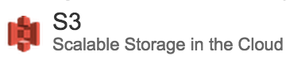

1. **Create an AWS S3 Bucket**

   Go to Services > S3.  Create a Bucket in S3, add a meaningful name (e.g. myappname-production)
   and region option, e.g. Northern California).

   Once you choose a region, search region codes here:
   http://www.bucketexplorer.com/documentation/amazon-s3--amazon-s3-buckets-and-regions.html

   You will need to add your region property in **config.rb** in the [Setup an AWS S3 Bucket](#aws_s3) step.

   

2. **Enable Static Website Hosting**

    Go to your bucket and click **Properties**.  Under **Static Website Hosting**, click **Enable website hosting**
    and add **index.html** in Index Document and **error.html** in Error Document. **Save.**

    

3. **Add CORS Configuration** for loading fonts from an origin other than your web application (e.g. Font Awesome).

    

**More on this**

  * [Working with Amazon S3 Buckets](http://docs.aws.amazon.com/AmazonS3/latest/dev/UsingBucket.html)

 5. Create an AWS Cloudfront Distribution
-------------
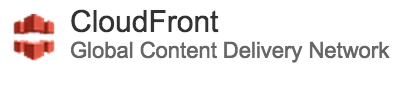

1. **Create an AWS Cloudfront Distribution**

    Go to Services > Cloudfront

2. Select "Web" as your delivery method:

  

3. **Create Distribution**

  * Add your S3 bucket name to the **Origin Domain Name** field.
  If you click on the field, a list will automatically appear.
  It should also autofill your Origin ID.  (e.g. example-bucket)

    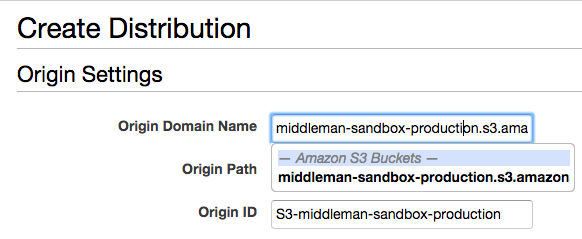

  **IMPORTANT: Delete the pre-autofilled Origin Domain Name**
  (e.g. middleman-sandbox-production.s3.amazonaws.com).
  Replace this with the AWS S3 Bucket **Static Website Hosting Endpoint**
  (e.g. middleman-sandbox-production.s3-website-us-west-1.amazonaws.com, see image below).
  This is necessary so your AWS Cloudfront domain (e.g. http://dXXXXXXXXXXX.cloudfront.net/)
  mirrors the AWS S3 static website hosting endpoint.

    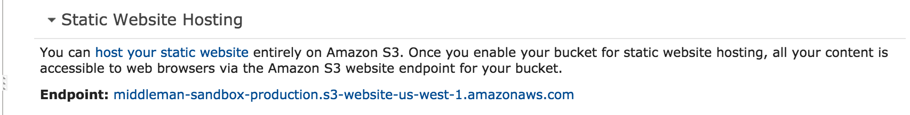

  * Under **Default Cache Behavior Settings**, click on the **Forward Headers** options list.  Click Whitelist Headers. Add Origin

  * Under **Distribution Settings**, add 'index.html' to the **Default Root Object**.

  * Click **Create Distribution**

4. You’ll be brought to a CloudFront Distributions page in which a Cloudfront domain name will be returned to you.
  (e.g. http://dXXXXXXXXXXX.cloudfront.net/)

  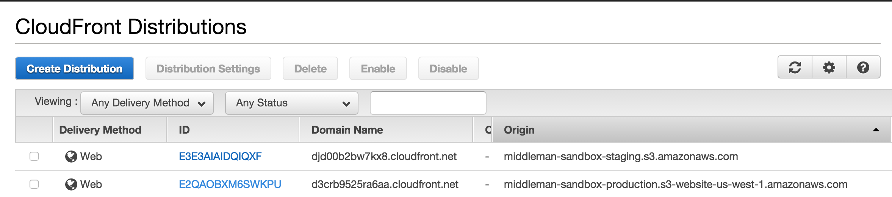

**More on this:**

  * [Getting Started with CloudFront](http://docs.aws.amazon.com/AmazonCloudFront/latest/DeveloperGuide/GettingStarted.html).

 6. Add middleman s3 sync gem and configuration
-------------

Use middeman-s3_sync gem to push assets to your AWS s3 bucket.

Add [middleman-s3_sync gem](https://github.com/fredjean/middleman-s3_sync) in your Gemfile and follow configuration instructions.  See [config.rb](https://github.com/monsoonco/Middleman-AWS-Prismic-CircleCi/blob/master/config.rb).

<pre><code>

    activate :s3_sync do |s3_sync|
      # The name of the S3 bucket you are targeting.
      s3_sync.bucket                     = ENV['AWS_S3_BUCKET_NAME']
      # The AWS region code for your bucket.
      # For region codes: http://www.bucketexplorer.com/documentation/amazon-s3--amazon-s3-buckets-and-regions.html
      s3_sync.region                     = ENV['AWS_REGION']
      s3_sync.aws_access_key_id          = ENV['AWS_ACCESS_KEY_ID']
      s3_sync.aws_secret_access_key      = ENV['AWS_SECRET_KEY']
      #s3_sync.delete                     = true # We delete stray files by default.
      #s3_sync.after_build                = true # We do not chain after the build step by default.
    end

</code></pre>

 7. Add middleman cloudfront gem and configuration
-------------
We're using middleman-cloudfront for AWS CloudFront cache invalidation.

Add [middleman-cloudfront gem](https://github.com/andrusha/middleman-cloudfront) and follow configuration instructions.  See [config.rb](https://github.com/monsoonco/Middleman-AWS-Prismic-CircleCi/blob/master/config.rb).
<pre><code>
      activate :cloudfront do |cf|
        cf.access_key_id                   = ENV['AWS_ACCESS_KEY_ID']
        cf.secret_access_key               = ENV['AWS_SECRET_KEY']
        cf.distribution_id                 = ENV['PRODUCTION_CLOUDFRONT_DISTRIBUTION_ID']
        cf.filter                          = /\.html$/i
        #cf.after_build                     = false  # default is false
      end

      after_s3_sync do |files_by_status|
        invalidate files_by_status[:updated]
      end
</code></pre>

You can watch invalidations processing if you go to CloudFront Distributions > Click on Cloudfront distribution ID > Invalidations tab

  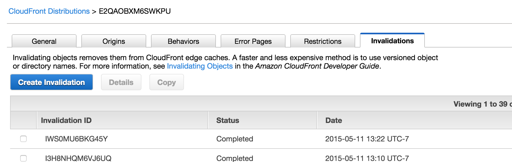

**More on this**

  * [Invalidating Objects (Web Distributions Only)](http://docs.aws.amazon.com/AmazonCloudFront/latest/DeveloperGuide/Invalidation.html)

 8. Pushing assets to AWS from your console as a first test
-------------

If you need to experiment with pushing assets to AWS S3 locally, you can do the following:

   * Create an aws.yml file at the root of the application.  Note that this file will be ignored for security (See [.gitignore](https://github.com/monsoonco/Middleman-AWS-Prismic-CircleCi/blob/master/.gitignore))
   * Add environmental variables from AWS LastPass notes to aws.yml
   * Uncomment  <code> ENV = YAML::load(File.open('aws.yml')) </code> in [config.rb](https://github.com/monsoonco/Middleman-AWS-Prismic-CircleCi/blob/master/config.rb)

   <pre><code>
      AWS_S3_BUCKET_NAME: ''
      AWS_REGION: ''
      AWS_ACCESS_KEY_ID: ''
      AWS_SECRET_KEY: ''
      PRODUCTION_CLOUD_DISTRIBUTION_ID: ''
    </code></pre>

   * Run these commands to push assets to AWS middleman-sandbox-staging bucket

   <code> bundle exec middleman build --verbose </code>

   <code> bundle exec middleman s3_sync --bucket=your-aws-bucket-name </code>

   <code> PRODUCTION_CLOUDFRONT_DISTRIBUTION_ID=XXXXXXXXXXX bundle exec middleman invalidate </code>

 9. CircleCi for continuous deployment
-------------

CircleCi will run deployment commands only when changes are merged into the branch
specified in circle.yml (e.g. <code> branch:master </code>).

1. Setup your Github account with [CircleCi](https://circleci.com/).
2. In CircleCi, add your project/repo.
3. Create a [circle.yml](https://github.com/monsoonco/Middleman-AWS-Prismic-CircleCi/blob/master/circle.yml) file in the root of your repo.

<pre><code>
  dependencies:
    pre:
      - bundle install

# To speed things up, you can also cache directories.  Uncomment this and replace this with code above.
# dependencies:
#   cache_directories:
#     - "~/.rvm/gems/ruby-2.0.0-p451"

  deployment:
    production:
      branch: master
      commands:
        - bundle exec middleman build --verbose

        # Push Middleman build to your AWS S3 bucket
        - bundle exec middleman s3_sync --bucket=middleman-sandbox-production

        # Invalidate cache in AWS Cloudfront
        - PRODUCTION_CLOUDFRONT_DISTRIBUTION_ID= bundle exec middleman invalidate

</code></pre>

 10. Set environmental variables in CircleCi
-------------

  Add the following AWS environmental variables required for continuous deployment in CircleCi.  In this case, we're pushing assets to your AWS S3 bucket and invalidating the cache in AWS Cloudfront.

  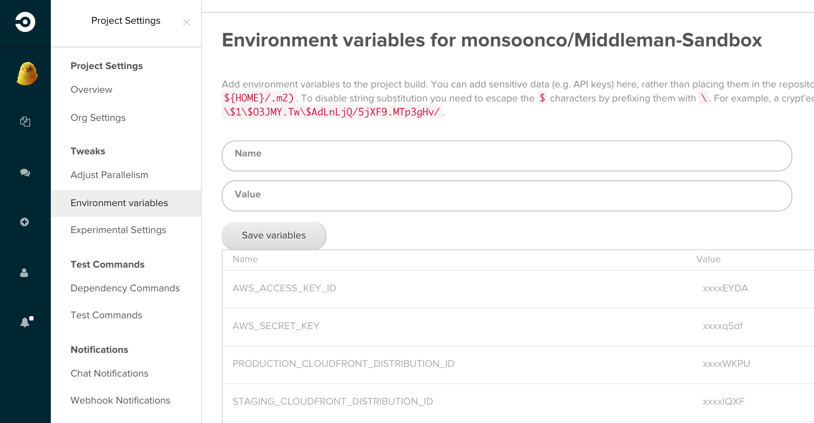

 11. Prismic content management and adding a webhook with CircleCi
-------------

1. Follow instructions in [Prismic](https://prismic.io/) to create a Document Mask and create content.

2. See Prismic's [documentation](https://developers.prismic.io/documentation/VBgeDDYAADMAz2Rw/developers-manual) for adding the API object and querying your Prismic repository with Ruby.  See [config.rb](https://github.com/monsoonco/Middleman-AWS-Prismic-CircleCi/blob/master/config.rb) as an example.

<pre><code>
    api = Prismic.api('https://prismic-project-example.prismic.io/api')
    response = api
     .form('everything')
     .query('[[:d = at(document.type, "document-mask-name")]]')
     .submit(api.master_ref)

    @something_to_put_in_view = response.results
</code></pre>

3. Go to your prismic account.  Settings > Webhooks.

4. Go to CircleCi and create an API token (Settings > API Tokens). Create a token for the prismic webhook.

  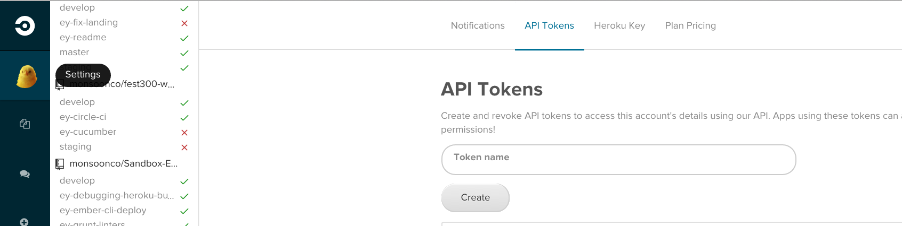

4. Add a POST request url (see below) from CircleCI in the Webhooks section of Prismic
 to trigger a build in CircleCi.  This will trigger a build targeted at the specified Github branch every time a document is published.

  **https://circleci.com/api/v1/project/:username/:project/tree/:branch?circle-token=:token**

  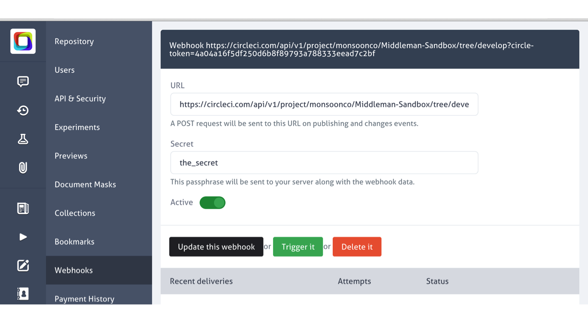

  More documentation resources on creating a webhook:

  * [Introducing prismic.io webhooks: integration with publishing and changes events](https://blog.prismic.io/U4SxWjAAAC8AQ1-W/introducing-prismicio-webhooks-integration-with-publishing-and-changes-events)
  * [Prismic Webhooks](https://developers.prismic.io/documentation/UjBeuLGIJ3EKtgBV/repository-administrators-manual#webhooks)
  * [CircleCi: Trigger a new build](https://circleci.com/docs/api#new-build)

 12. Launch in AWS
-------------

You may use your own DNS provider (e.g. GoDaddy) vs Amazon's [Route 53 DNS manager](http://aws.amazon.com/route53/).
Add your official domain name to Alternate Domain Names (CNAMEs)
under the General tab in Cloudfront Distributions. Make sure you place the urls on seperate lines.

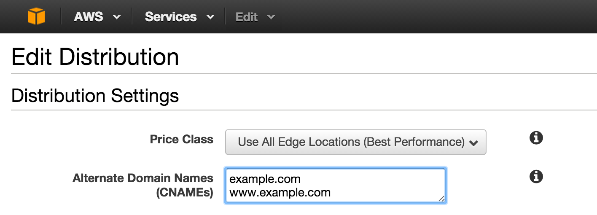

**More on this**

  * [Using Alternate Domain Names (CNAMEs)](http://docs.aws.amazon.com/AmazonCloudFront/latest/DeveloperGuide/CNAMEs.html)

**The MIT License (MIT)**

Copyright (c) <year> <copyright holders>

Permission is hereby granted, free of charge, to any person obtaining a copy
of this software and associated documentation files (the "Software"), to deal
in the Software without restriction, including without limitation the rights
to use, copy, modify, merge, publish, distribute, sublicense, and/or sell
copies of the Software, and to permit persons to whom the Software is
furnished to do so, subject to the following conditions:

The above copyright notice and this permission notice shall be included in
all copies or substantial portions of the Software.

THE SOFTWARE IS PROVIDED "AS IS", WITHOUT WARRANTY OF ANY KIND, EXPRESS OR
IMPLIED, INCLUDING BUT NOT LIMITED TO THE WARRANTIES OF MERCHANTABILITY,
FITNESS FOR A PARTICULAR PURPOSE AND NONINFRINGEMENT. IN NO EVENT SHALL THE
AUTHORS OR COPYRIGHT HOLDERS BE LIABLE FOR ANY CLAIM, DAMAGES OR OTHER
LIABILITY, WHETHER IN AN ACTION OF CONTRACT, TORT OR OTHERWISE, ARISING FROM,
OUT OF OR IN CONNECTION WITH THE SOFTWARE OR THE USE OR OTHER DEALINGS IN
THE SOFTWARE.